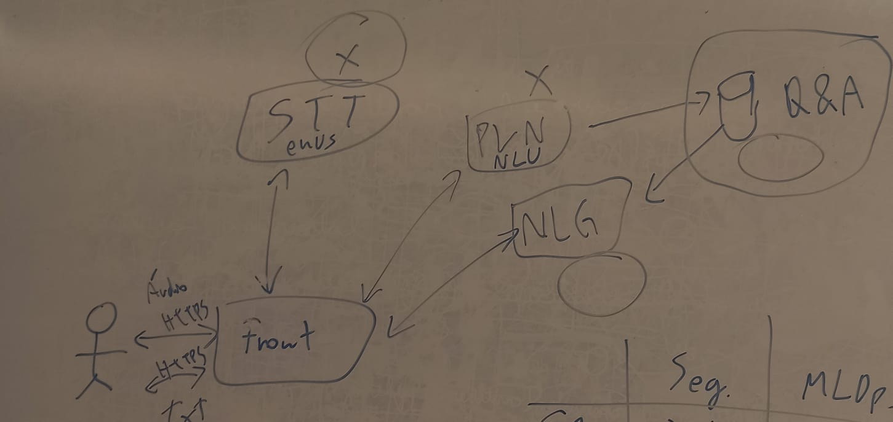

# Proposta de Melhoria do Requisito Não Funcional de Segurança no Sistema Conversacional

## Introdução
Sistemas conversacionais, como chatbots e assistentes virtuais, desempenham um papel cada vez mais relevante na comunicação digital. No entanto, a segurança é um ponto crítico que precisa ser aprimorado, especialmente contra ataques adversariais e a exploração de vulnerabilidades (BERTOLDO et al., 2021). A arquitetura da solução atual (conforme imagem) demonstra pontos que necessitam de maior proteção, como a comunicação entre os módulos e o processamento de dados sensíveis. Proteger esses fluxos é fundamental para garantir integridade e confiabilidade ao usuário final.

## Solução Proposta
A arquitetura proposta considera a inserção de camadas adicionais de segurança em cada módulo do sistema conversacional, conforme o diagrama abaixo.

### Descrição dos Módulos

1. **Front-end**: Ponto de contato com o usuário final, responsável por receber e enviar dados via HTTPS. Será implementada uma validação inicial dos dados, mitigando tentativas de ataques via input malicioso.
   
2. **STT (Speech-to-Text)**: Converte áudio em texto, com a responsabilidade de sanitizar os dados recebidos, protegendo contra ataques que possam comprometer a segurança do modelo de NLU.

3. **PLN (Processamento de Linguagem Natural)**: Módulo crucial que interpreta a linguagem. Adicionaremos um módulo de análise semântica para detecção de comandos suspeitos ou entradas adversariais.

4. **NLG (Natural Language Generation)**: Responsável pela geração de respostas. Irá incluir um componente de monitoramento em tempo real para identificar e prevenir respostas que possam expor o sistema a riscos.

5. **Q&A e Banco de Dados**: A interação com a base de conhecimento será protegida com autenticação forte, e os dados serão monitorados continuamente para detectar padrões incomuns de uso.

## Conclusão
A proposta apresentada foca em adicionar camadas de segurança a cada módulo do sistema conversacional. Embora o esforço de implementação exija tempo para testes e validações contínuas, as melhorias trarão maior confiança ao sistema, prevenindo ataques adversariais e melhorando a experiência do usuário. Assegurar a integridade de dados desde o front-end até a resposta final proporcionará uma robustez maior ao ambiente de comunicação.

## Referências Bibliográficas
- BERTOLDO, F. et al. **Segurança em sistemas conversacionais**. Revista Brasileira de Inteligência Artificial, v. 12, n. 2, p. 45-55, 2021.
- LLM-ATTACKS. **Universal and Transferable Attacks on Aligned Language Models**. Disponível em: https://llm-attacks.org/index.html. Acesso em: 11 set. 2024.
